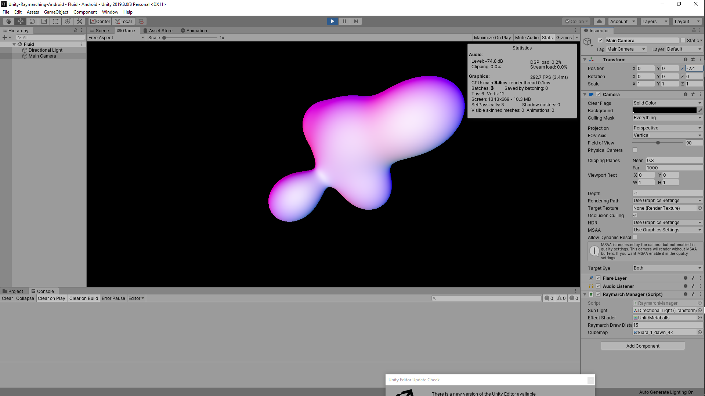
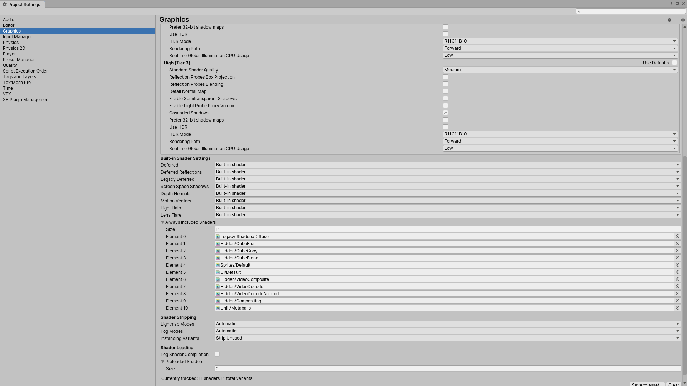
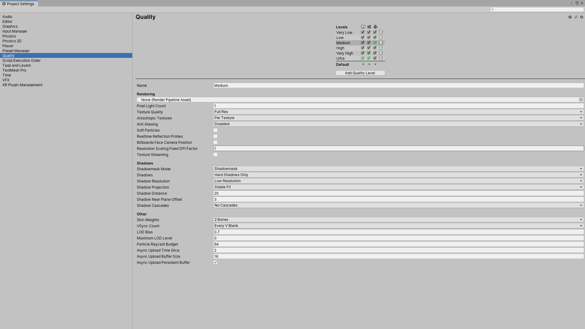

# Unity-Raymarching-Android
Officially my first proper try at raymarching in Unity, based on [this project](https://github.com/Flafla2/Generic-Raymarch-Unity).
It's really useful, but if you are into creative coding, you might want to render a different shape like a metaball rather than a torus. This repo then could be of interest.

## Settings
Check 'Cascaded Shadows' and include your custom raymarch shaders as in the screenshots below. Also change the default quality for Android builds.

